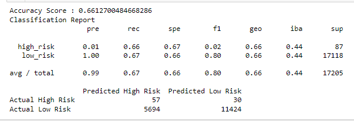
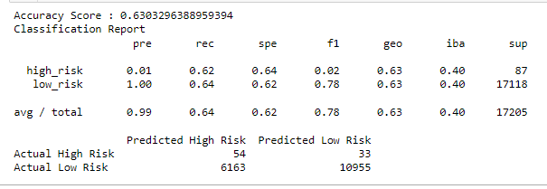
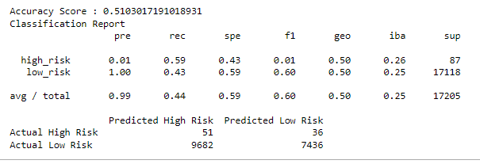
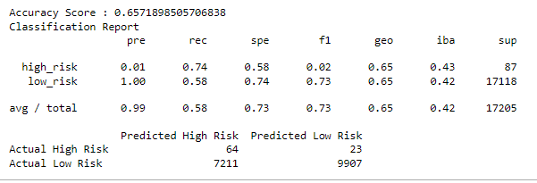
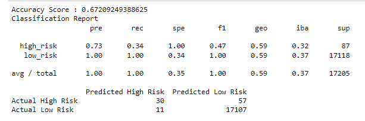
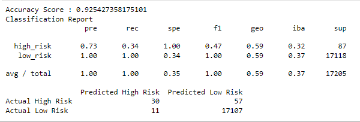

#  Credit_Risk_Analysis
## Overview
Fast Lending is a peer-to-peer lending services company.  They would like to better predict credit risk, resulting in a more accurate identification of good candidates, reducing default rates.

You will be working with Jill to build and evaluate models  using resampling and boosting methods.  You are now ready to apply machine learning to solve a real-world challenge: credit card risk.

## Resources
Software(s): Python 3.7, Scikit-Learn and Imbalanced-Learn libraries

## Purpose
You’ll need to employ different techniques to train and evaluate models with unbalanced classes. Jill asks you to use imbalanced-learn and scikit-learn libraries to build and evaluate models using resampling.  Using the credit card credit dataset from LendingClub, a peer-to-peer lending services company, you’ll oversample the data using the RandomOverSampler and SMOTE algorithms, and undersample the data using the ClusterCentroids algorithm. Then, you’ll use a combinatorial approach of over- and undersampling using the SMOTEENN algorithm. Next, you’ll compare two new machine learning models that reduce bias, BalancedRandomForestClassifier and EasyEnsembleClassifier, to predict credit risk. 

## Results

Using bulleted lists, describe the balanced accuracy scores and the precision and recall scores of all six machine learning models. Use screenshots of your outputs to support your results.  

* 1 RandomOverSampler - oversampling 

Accuracy = 67%
Precision high risk = 1%
Precision low risk = 100%
Recall high risk = 66%
Recall low risk = 67%

See the Confusion Matrix and Imbalanced Calssification Report below: 

 

* 2 SMOTE - oversampling 

Accuracy = 63%
Precision high risk = 1%
Precision low risk = 100%
Recall high risk = 62%
Recall low risk = 64%

See the Confusion Matrix and Imbalanced Calssification Report below: 

 

* 3 ClusterCentroids - undersampling 

Accuracy = 51%
Precision high risk = 1%
Precision low risk = 100%
Recall high risk = 59%
Recall low risk = 43%

See the Confusion Matrix and Imbalanced Calssification Report below: 

 

* 4 SMOTEENN - combination 

Accuracy = 66%
Precision high risk = 1%
Precision low risk = 100%
Recall high risk = 74%
Recall low risk = 58%

See the Confusion Matrix and Imbalanced Calssification Report below: 

 

* 5 Random Forest Classifying 

Accuracy = 67%
Precision high risk = 73%
Precision low risk = 100%
Recall high risk = 34%
Recall low risk = 100%

See the Confusion Matrix and Imbalanced Calssification Report below: 

 

* 6 Easy Ensemble Classifying 

Accuracy = 92%
Precision high risk = 1%
Precision low risk = 100%
Recall high risk = 34%
Recall low risk = 100%

See the Confusion Matrix and Imbalanced Calssification Report below: 

 

* Summarize the results of the machine learning models, and include a recommendation on the model to use, if any. If you do not recommend any of the models, justify your reasoning. 

This analysis is trying to find the best model that can detect if a loan is high risk or not.   

While the average precision for all models was consistently 99% - 100%, the average recall (sensitivity) ranged from  44% - 100%, with both Random Forest and Easy Ensemble returning 100%. 

The average F1 scores ranged from 60% - 100%, again with both Random Forest and Easy Ensemble returning 100%. 

The accuracy score indicates how well the model performs in general and the Easy Ensemble Classifying model scored 92% while the other models scored 67% or below. 

Based on the above results, both the Random Forest and Easy Ensemble models performed better than the others; however, I would recommend the Easy Ensemble model because of its higher accuracy score. 

